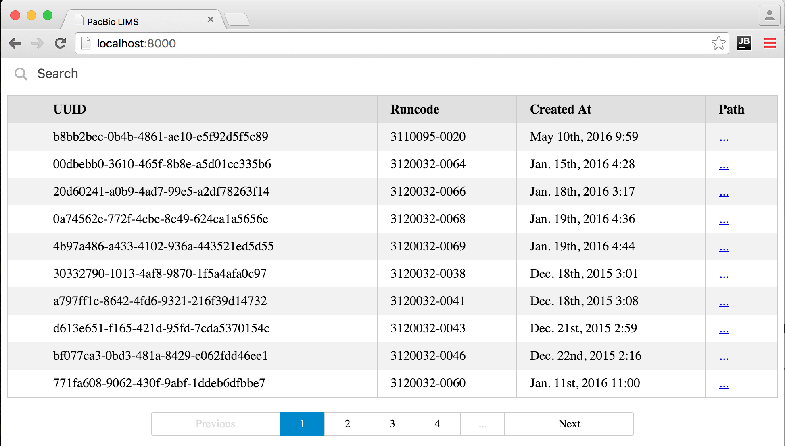

# Searchkit LIMS Example
Example Searchkit.co app for a LIMS data saved in Elasticsearch.

```bash
# Host this checkout as a website
python -m SimpleHTTPServer
```

Browse to [localhost:8000](http://localhost:8000/) to see the app.



See the code for all the components.

1. [`index.hml`](index.html) is plain HTML page that'll be populated by ReactJS via `js/subreadset.js`
2. JavaScript is written in ES6 and translated on-the-fly via babel.js and the `text/babel` MIME type.
  - [`js/app.js`](js/app.js) has some global state and pretty-print helper functions.
  - [`js/subreadset.js`](js/subreadset.js) is the meat of the application. Two ReactJS components and use of Searchkit.co's related ReactJS components.

This example originally assumed access to a dump of existing LIMS data at [PacBio](https://github.com/PacificBiosciences). If you don't have that, see below to mock up example data.

## Running Elasticsearch + Mock Data

The above example assmues that you already have an ES host with some data. If needed locally, you can manaully launch ES and mock up some data.

TODO: post notes.
