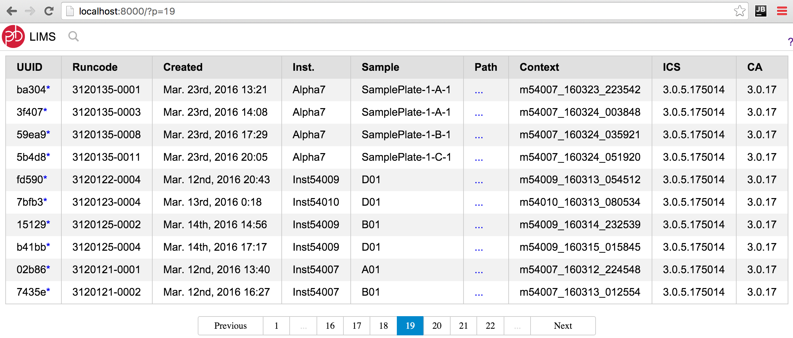
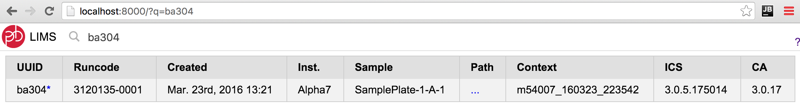

# Searchkit LIMS Example
Example Searchkit.co app for a LIMS data saved in Elasticsearch.

```bash
# Host this checkout as a website
python -m SimpleHTTPServer
```

Browse to [localhost:8000](http://localhost:8000/) to see the app.




See the code for all the components.

1. [`index.hml`](index.html) is plain HTML page that'll be populated by ReactJS via `js/subreadset.js`
2. JavaScript is written in ES6 and translated on-the-fly via babel.js and the `text/babel` MIME type.
  - [`js/app.js`](js/app.js) has some global state and pretty-print helper functions.
  - [`js/subreadset.js`](js/subreadset.js) is the meat of the application. Two ReactJS components and use of Searchkit.co's related ReactJS components.

This example originally assumed access to a dump of existing LIMS data at [PacBio](https://github.com/PacificBiosciences). If you don't have that, see below to mock up example data.

## Running Elasticsearch + Mock Data

The above example assmues that you already have an [ES](https://www.elastic.co/) host with some data. If needed locally, you can manaully launch ES and mock up some data.

Install elastic search from [elastic.co's download page](https://download.elastic.co/elasticsearch/release/org/elasticsearch/distribution/tar/elasticsearch/2.3.2/elasticsearch-2.3.2.tar.gz).

Edit the `config/elasticsearch.yml` config file to allow for CORS and (optional) be single node.

```yml
# Make single node
index.number_of_shards: 1
index.number_of_replicas: 0

# Allow Cross-Origin Resource Sharing (CORS) 
http.cors.enabled : true  
http.cors.allow-origin : "*"
http.cors.allow-methods : OPTIONS, HEAD, GET, POST, PUT, DELETE
http.cors.allow-headers : X-Requested-With,X-Auth-Token,Content-Type, Content-Length
```

Start elastic search locally so `localhost:9200` is a server.

```bash
bin/elasticsearch
```

All of the next steps are modeled after a data import script (`import-pbi-collections.py` not shown here, nor needed) where the ES index is `lims_subreadset_v2` and doctype is `lims_subreadset_v2`.

(Optional) delete all old data.

```bash
INDEX_NAME=lims_subreadset_v2
DOC_TYPE=lims_subreadset_v2
# http://stackoverflow.com/questions/23917327/delete-all-documents-from-index-type-without-deleting-type
curl -XDELETE http://localhost:9200/$INDEX_NAME/$DOC_TYPE/_query -d '{
    "query" : {
        "match_all" : {}
    }
}'
```

Create an index.

```bash
# Set needed vars
INDEX_NAME=lims_subreadset_v2
DOC_TYPE=lims_subreadset_v2
ID=uuid
curl -X PUT "http://localhost:9200/$INDEX_NAME/" -d '{
    "settings":{
        "analysis":{
            "analyzer":{
                "analyzer1":{
                    "type":"custom",
                    "tokenizer":"standard",
                    "filter":[ "standard", "lowercase", "stop", "kstem", "ngram" ]
                }
            },
            "filter":{
                "ngram":{
                    "type":"ngram",
                    "min_gram":2,
                    "max_gram":15
                }
            }
        }
    },
    "mappings": {
        "$DOC_TYPE": {
            "properties": {
                "uuid": {
                    "type": "string",
                    "search_analyzer" : "analyzer1",
                    "index_analyzer" : "analyzer1"
                }
            }
        }
    }
}';
```

Upload some JSON data for display in the UI.

```bash
# Set needed vars
INDEX_NAME=lims_subreadset_v2
DOC_TYPE=lims_subreadset_v2

# Add b8bb2bec-0b4b-4861-ae10-e5f92d5f5c89
curl -XPUT http://localhost:9200/lims_subreadset_v2/lims_subreadset_v2/b8bb2bec-0b4b-4861-ae10-e5f92d5f5c89 -d '{
  "uuid": "b8bb2bec-0b4b-4861-ae10-e5f92d5f5c89",
   "ics_version": "3.1.0.177453",
   "created_at": "2016-05-10T13:59:36.032825",
   "runcode": "3110095-0020",
   "inst_id": "54003",
   "pa_version": "3.1.0-UNKNOWN",
   "inst_name": "Inst54003",
   "context": "m54003_160427_220553",
   "exp_id": 3110095,
   "path": "/pbi/collections/311/3110095/r54003_20160427_220045/1_A01/m54003_160427_220553.subreadset.xml",
   "sample_name": "A01"
}'

# Add 82c3bb5c-a0b1-4c58-84ac-4726595f8e3c
curl -XPUT http://localhost:9200/lims_subreadset_v2/lims_subreadset_v2/82c3bb5c-a0b1-4c58-84ac-4726595f8e3c -d '{"uuid": "82c3bb5c-a0b1-4c58-84ac-4726595f8e3c", "ics_version": "", "created_at": "2015-12-15T13:44:12.904122", "runcode": "3120032-0002", "inst_id": "60001", "pa_version": "", "inst_name": "Inst60001", "context": "m54009_151204_224517", "exp_id": 3120032, "path": "/pbi/collections/312/3120032/r54009_20151204_224507/1_A01/m54009_151204_224517.subreadset.xml", "sample_name": "SamplePlate-1-A-1"}'

# Add 684a00ae-954f-4392-8864-d38aa5fb6b26
curl -XPUT http://localhost:9200/lims_subreadset_v2/lims_subreadset_v2/684a00ae-954f-4392-8864-d38aa5fb6b26 -d '{"uuid": "684a00ae-954f-4392-8864-d38aa5fb6b26", "ics_version": "", "created_at": "2016-01-15T09:22:08.243273", "runcode": "3120032-0065", "inst_id": "60001", "pa_version": "", "inst_name": "Inst60001", "context": "m54009_160115_171035", "exp_id": 3120032, "path": "/pbi/collections/312/3120032/r54009_20160115_171025/1_A01/m54009_160115_171035.subreadset.xml", "sample_name": "SamplePlate-1-A-1"}'
```

Finally, aim SearchKit to [http://localhost:9200/lims_subreadset_v2/lims_subreadset_v2/](http://localhost:9200/lims_subreadset_v2/lims_subreadset_v2/_search). You can open the link in your browser to see the ES response. Note the link appends `_search`.

You'll see something similar to the following. Note that ES a bunch of meta-data along with the JSON records. You can even have it return explanations regarding why matches and ordering is as it is. See the [search docs](https://www.elastic.co/guide/en/elasticsearch/reference/current/search-uri-request.html).

```json
{
  "took": 31,
  "timed_out": false,
  "_shards": {
    "total": 5,
    "successful": 5,
    "failed": 0
  },
  "hits": {
    "total": 3,
    "max_score": 1,
    "hits": [
      {
        "_index": "lims_subreadset_v2",
        "_type": "lims_subreadset_v2",
        "_id": "b8bb2bec-0b4b-4861-ae10-e5f92d5f5c89",
        "_score": 1,
        "_source": {
          "uuid": "b8bb2bec-0b4b-4861-ae10-e5f92d5f5c89",
          "ics_version": "3.1.0.177453",
          "created_at": "2016-05-10T13:59:36.032825",
          "runcode": "3110095-0020",
          "inst_id": "54003",
          "pa_version": "3.1.0-UNKNOWN",
          "inst_name": "Inst54003",
          "context": "m54003_160427_220553",
          "exp_id": 3110095,
          "path": "\/pbi\/collections\/311\/3110095\/r54003_20160427_220045\/1_A01\/m54003_160427_220553.subreadset.xml",
          "sample_name": "A01"
        }
      },
      {
        "_index": "lims_subreadset_v2",
        "_type": "lims_subreadset_v2",
        "_id": "82c3bb5c-a0b1-4c58-84ac-4726595f8e3c",
        "_score": 1,
        "_source": {
          "uuid": "82c3bb5c-a0b1-4c58-84ac-4726595f8e3c",
          "ics_version": "",
          "created_at": "2015-12-15T13:44:12.904122",
          "runcode": "3120032-0002",
          "inst_id": "60001",
          "pa_version": "",
          "inst_name": "Inst60001",
          "context": "m54009_151204_224517",
          "exp_id": 3120032,
          "path": "\/pbi\/collections\/312\/3120032\/r54009_20151204_224507\/1_A01\/m54009_151204_224517.subreadset.xml",
          "sample_name": "SamplePlate-1-A-1"
        }
      },
      {
        "_index": "lims_subreadset_v2",
        "_type": "lims_subreadset_v2",
        "_id": "684a00ae-954f-4392-8864-d38aa5fb6b26",
        "_score": 1,
        "_source": {
          "uuid": "684a00ae-954f-4392-8864-d38aa5fb6b26",
          "ics_version": "",
          "created_at": "2016-01-15T09:22:08.243273",
          "runcode": "3120032-0065",
          "inst_id": "60001",
          "pa_version": "",
          "inst_name": "Inst60001",
          "context": "m54009_160115_171035",
          "exp_id": 3120032,
          "path": "\/pbi\/collections\/312\/3120032\/r54009_20160115_171025\/1_A01\/m54009_160115_171035.subreadset.xml",
          "sample_name": "SamplePlate-1-A-1"
        }
      }
    ]
  }
}
```